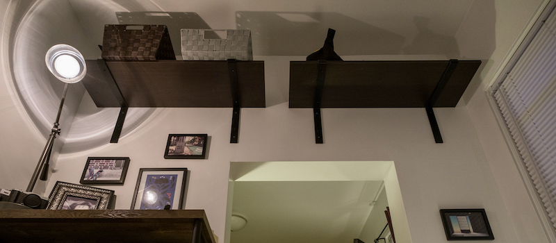

# Shelves

Just a little script to help evenly space shelf brackets.

## Usage

```shell
chmod u+x index.js # first run only
./index.js [OPTIONS] [ARGS]
```

## Options

```shell
-w    Wall width (Default is 82.5)
-s    Shelf width (Default is 36)
-c    Shelf count (Default is 2)
-p    Padding between the edge of the shelf and the center of the bracket (Default is 5)
-v    Display the current version
-h    Display help and usage details
```


